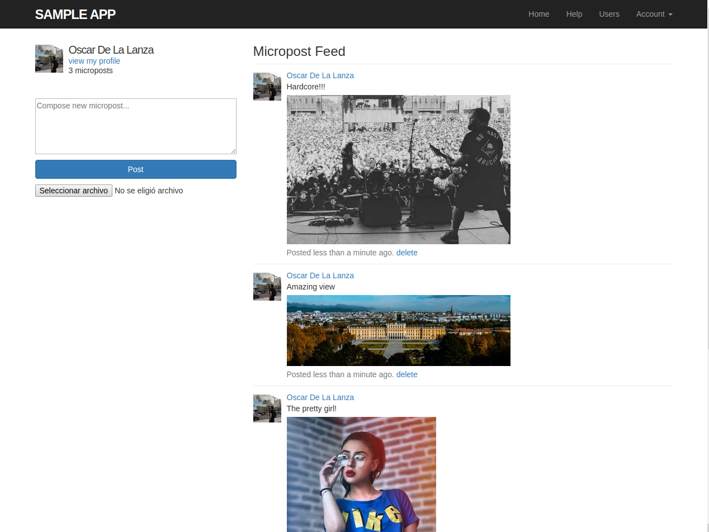

# Ruby on Rails Tutorial Static Pages
> This is a project based in Ruby on Rails tutorial. The goal of this project is develop a basic app similar to a social 
> network with the basic features to create micro-posts.

This is the sample application for
[*Ruby on Rails Tutorial:
Learn Web Development with Rails*](https://www.railstutorial.org/)
by [Michael Hartl](http://www.michaelhartl.com/).

## License

All source code in the [Ruby on Rails Tutorial](https://www.railstutorial.org/)
is available jointly under the MIT License and the Beerware License. See
[LICENSE.md](LICENSE.md) for details.

## Live Demo

[Live Demo Link](https://fast-dawn-38965.herokuapp.com/)

## Getting started

> To get a local copy up and running follow these simple example steps.

### Prerequisites

- `Git`
- `Ruby 2.6.5`
- `Rails 6`
- `PostgreSQL`

### Setup

To clone the project in your local environment do the following

- Open a new `terminal` window and navigate to the directory where the project will be stored
- Run the command `git clone git@github.com:oscardelalanza/satic_pages.git`
- Run the command `cd satic_pages` to enter the project directory

### Install

- Install the required gems running the command `bundle install --without production`
- Install the required node modules running the command `yarn install`
- Create and migrate the database running the command `rails db:migrate`

### Usage

- Click on `Sign up now!` button and fill the form to create your account
- Check your email and open the `activation` link to start using your account
- Use the links in the navigation bar to switch between the different sections of the site.

#### Home

In this section is the main section, you will find the `Micropost Feed` and an input to create new `posts`

- `Micropost feed` display all your posts sorted by date. Notice that also each post contain a `delete` link to remove unwanted posts

- `New posts` form to create new posts, and also attach images to it.

#### Users

In this section you will find the list of users registered in the app. 

#### Account

This is a dropdown list that displays the following links

- `Profile` this link will redirect you to your profile info.
- `Settings` use this link if you want to update your account info.
- `Log out` use this link to end your session in the app

### Run tests

- Run the command `rails test`

### Deployment

- To start the local server run the command `rails server`

For more information, see the
[*Ruby on Rails Tutorial* book](https://www.railstutorial.org/book).

## Authors

👤 **Oscar De La Lanza**

- Github: [@oscardelalanza](https://github.com/oscardelalanza)
- Twitter: [@twitterhandle](https://twitter.com/oscardelalanza)
- Linkedin: [Oscar De La Lanza](https://linkedin.com/in/oscardelalanza/)
- Email: oscardelalanza@gmail.com

## 🤝 Contributing

Contributions, issues and feature requests are welcome!

Feel free to check the [issues page](issues/).

## Show your support

Give a ⭐️ if you like this project!
